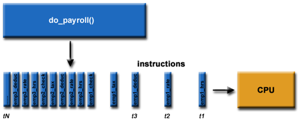
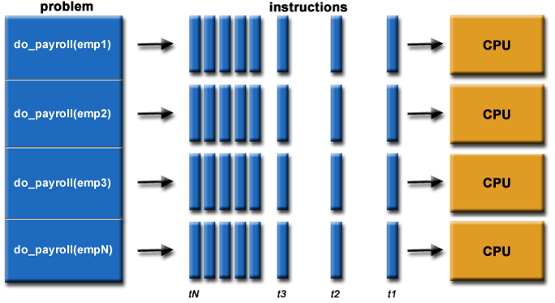
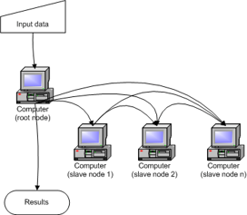
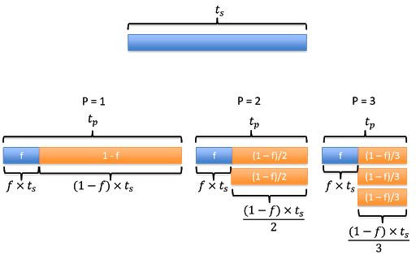

> ## Envision the payroll problem
>
>  
{: .slide}

> ## Components of a computation problem
> - Computational task
> - Execution framework.
> - Computing resources. 
{: .slide}

> ## Parallelizing payroll
>
>  
{: .slide}

> ## Computational tasks should be able to ...
> - Be borken apart into **discrete** pieces of work that can be solved simultaneously.
> - Be solved in less time with multiple computing resources than with a single computing resource. 
{: .slide}

> ## Execution framework should be able to ...
> - Execute multiple program instructions concurrently at any moment in time
{: .slide}

> ## Computing resources might be ...
> - A single computer with multiple processors. 
> - An arbitrary number of computers connected by a network.
> - A special computational component inside a single computer, separate 
> from the main processors (GPU), or
> - Any combintations of the above. 
{: .slide}

> ## The progress
> How do parallel and distributed computing resources evolve?
> 
> > ## Single site, single computer, single core
> >
> > 
> {: .slide}
>
> > ## Single site, single computer, multiple cores
> >
> > 
> {: .slide}
>
> > ## Single site, multiple computers, multiple cores
> >
> > 
> {: .slide}
>
> > ## Multiple sites, multiple computers, multiple cores, federated domains
> >
> > 
> {: .slide}
>
> > ## Multiple site, multiple computers, multiple cores, virtula unified domain
> >
> > 
> {: .slide}
{: .slide}

> ## Distributed computing systems
> "A collection of individual computing devices that can communicate with each 
> other." (Attiya and Welch, 2004).
> 
> > ## emphasis ...
> >
> > "A collection of individual computing devices that can **communicate** with each 
> > other." (Attiya and Welch, 2004).
> {: .slide}
{: .slide}

> ## Can we just throw more computers at the problem?
> - **Parallel speedup**: how much faster the program becomes once
> some computing resources are added. 
> - **Parallel efficiency**: Ratio of performance improvement per 
> individual unit of computing resource. 
{: .slide}

> ## Parallel speedup
> - Given `p` processors, 
> - Speedup, `S(p)`, is the ratio of the time it takes to run the program 
> using **a single processor** over the time it takes to run the program
> using **`p` processors**.
> - The time it takes to run the program using a single processor, $$t_{s}$$: **sequential run time**
> - The time it takes to the the program using multiple processor, $$t_{p}$$: **parallel run time**
> $$\\\\S(p) = \frac{sequential\ run\ time}{parallel\ run\ time} = \frac{t_s}{t_p}\\$$  
>
{: .slide}

> ## Example 1
> 
> A program takes 30 seconds to run on a single-core machine and 20 seconds to run on a 
> dual-core machine. What is the speedup of this program?
>  
> > ## Solution
> > $$t_s=30$$  
> > $$t_p=20$$  
> > $$S=\frac{t_s}{t_p}=\frac{30}{20}=1.5$$
> {: .solution}
{: .challenge}

> ## Theoretical max
> - Let `f` be the fraction of the program that is not parallelizable. 
> - Assume no overhead. 
> - Running the program using one processor will take time $$t_s$$.
> - The parallel run time, $$t_p$$, can be calculated as the time it take to run 
> the fraction that is non-parallelizable ($$f\times t_s$$) plus the remainning parallelizable
> fraction ($$1-f$$). 
> - If $$p=1$$, this simplifies to $$t_p=f\times t_s + (1-f)\times t_s$$.
> - Assume no overhead, this means that we reduce the speed by half as we double the number of processor.
> - And so on ...
>  
{: .slide}

> ## Amdahl's Law
> - This brings us to Amdahl's Law, which quantifies speedup in term of 
> number of processors and fraction of non-parallelizable code:  
> $$S(p)=\frac{t_s}{t_p}=\frac{t_s}{f\times t_s + (1-f)\times t_s}=\frac{1}{f + \frac{1-f}{p}}=\frac{p}{f \times (p-1) + 1}$$  
>
{: .slide}

> ## Parallel efficiency
> - The efficiency `E` is then defined as the ratio of speedup `S(p)` over the number of processors `p`.  
> $$E=\frac{\frac{p}{f \times (p-1) + 1}}{p}=\frac{1}{f \times (p-1) + 1}$$  
> - E is often measured as percentage. 
> - For example, `E = 0.8` means the parallel efficiency is 80%.
{: .slide}



