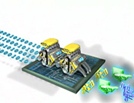

> ## Envision the payroll problem
>
>  
{: .slide}

> ## Components of a computation problem
> - Computational task
> - Execution framework.
> - Computing resources. 
{: .slide}

> ## Parallelizing payroll
>
>  
{: .slide}

> ## Computational tasks should be able to ...
> - Be borken apart into **discrete** pieces of work that can be solved simultaneously.
> - Be solved in less time with multiple computing resources than with a single computing resource. 
{: .slide}

> ## Execution framework should be able to ...
> - Execute multiple program instructions concurrently at any moment in time
{: .slide}

> ## Computing resources might be ...
> - A single computer with multiple processors. 
> - An arbitrary number of computers connected by a network.
> - A special computational component inside a single computer, separate 
> from the main processors (GPU), or
> - Any combintations of the above. 
{: .slide}

> ## The progress
> How do parallel and distributed computing resources evolve?
> 
> > ## Single site, single computer, single core
> >
> > 
> {: .slide}
>
> > ## Single site, single computer, multiple cores
> >
> > 
> {: .slide}
>
> > ## Single site, multiple computers, multiple cores
> >
> > 
> {: .slide}
>
> > ## Multiple sites, multiple computers, multiple cores, federated domains
> >
> > 
> {: .slide}
>
> > ## Multiple site, multiple computers, multiple cores, virtula unified domain
> >
> > 
> {: .slide}
{: .slide}

> ## Distributed computing systems
> "A collection of individual computing devices that can communicate with each 
> other." (Attiya and Welch, 2004).
> 
> > ## emphasis ...
> >
> > "A collection of individual computing devices that can **communicate** with each 
> > other." (Attiya and Welch, 2004).
> {: .slide}
{: .slide}

> ## Can we just throw more computers at the problem?
> - **Parallel speedup**: how much faster the program becomes once
> some computing resources are added. 
> - **Parallel efficiency**: Ratio of performance improvement per 
> individual unit of computing resource. 
{: .slide}

> ## Parallel speedup
> - Given `p` processors, 
> - Speedup, `S(p)`, is the ratio of the time it takes to run the program 
> using **a single processor** over the time it takes to run the program
> using **`p` processors**.
> - The time it takes to run the program using a single processor, $$t_{s}$$: **sequential run time**
> - The time it takes to the the program using multiple processor, $$t_{p}$$: **parallel run time**
> $$\\\\S(p) = \frac{sequential\ run\ time}{parallel\ run\ time} = \frac{t_s}{t_p}\\$$  
>
{: .slide}

> ## Example 1
> 
> A program takes 30 seconds to run on a single-core machine and 20 seconds to run on a 
> dual-core machine. What is the speedup of this program?
>  
> > ## Solution
> > $$t_s=30$$  
> > $$t_p=20$$  
> > $$S=\frac{t_s}{t_p}=\frac{30}{20}=1.5$$
> {: .solution}
{: .challenge}

> ## Theoretical max
> - Let `f` be the fraction of the program that is not parallelizable. 
> - Assume no overhead. 
> - Running the program using one processor will take time $$t_s$$.
> - The parallel run time, $$t_p$$, can be calculated as the time it take to run 
> the fraction that is non-parallelizable ($$f\times t_s$$) plus the remainning parallelizable
> fraction ($$1-f$$). 
> - If $$p=1$$, this simplifies to $$t_p=f\times t_s + (1-f)\times t_s$$.
> - Assume no overhead, this means that we reduce the speed by half as we double the number of processor.
> - And so on ...
>  
{: .slide}

> ## Amdahl's Law
> - This brings us to Amdahl's Law, which quantifies speedup in term of 
> number of processors and fraction of non-parallelizable code:  
> $$S(p)=\frac{t_s}{t_p}=\frac{t_s}{f\times t_s + (1-f)\times t_s}=\frac{1}{f + \frac{1-f}{p}}=\frac{p}{f \times (p-1) + 1}$$  
>
{: .slide}

> ## Parallel efficiency
> - The efficiency `E` is then defined as the ratio of speedup `S(p)` over the number of processors `p`.  
> $$E=\frac{\frac{p}{f \times (p-1) + 1}}{p}=\frac{1}{f \times (p-1) + 1}$$  
> - E is often measured as percentage. 
> - For example, `E = 0.8` means the parallel efficiency is 80%.
{: .slide}

> ## Example 2
> 
> Suppose that 4% of my application is serial. What is my predicted speedup
> according to Amdahl's Law on 5 processors?
>  
> > ## Solution
> > $$f=0.04$$  
> > $$p=5$$  
> > $$S=\frac{p}{(p-1)f + 1)}=\frac{5}{4 \times 0.4 +1}=1.9231$$
> {: .solution}
{: .challenge}

> ## Example 3
> 
> Suppose that I get a speedup of 8 when I run my application on
> 10 processors. According to Amdahl's Law:
> - What portion of my code is serial?
> - What is the speedup on 20 processors?
> - What is the efficiency on 5 processors? 20 processors?
> - What is the best speedup that I could achieve?
>  
> > ## Serial portion
> > $$S=8$$  
> > $$p=10$$  
> > $$S=\frac{p}{(p-1)f + 1)}$$  
> > $$8=\frac{10}{9f+1}$$  
> > $$9f + 1 = \frac{10}{8}$$  
> > $$f=\frac{1}{36}$$  
> {: .solution}
>
> > ## Speedup on 20 processors
> > $$f=\frac{1}{36}$$  
> > $$p=20$$  
> > $$S_20=\frac{p}{(p-1)f + 1)}=\frac{20}{\frac{19}{36}+1} \approx 13.0909$$  
> {: .solution}
>
> > ## Efficiency
> > $$E=\frac{1}{(p-1)f + 1}$$  
> > $$E_5=\frac{1}{\frac{4}{36}+1} = 90% $$  
> > $$E_20=\frac{1}{\frac{19}{36} + 1} \approx 65.45% $$  
> {: .solution}
>
> > ## Best speedup
> > $$f=\frac{1}{36}$$  
> > $$S_{\infty}=\lim_{p \to +\infty} \frac{p}{(p-1)f + 1} = \lim_{p \to +\infty} \frac{1}{\frac{p}{p-1}f + \frac{1}{p}}=\frac{1}{f}$$  
> > $$S_{\infty}= 36$$  
> > 
> > - In other word, the highest number of processors one should add to this problem is 36.
> {: .solution}
{: .challenge}

> ## Limiting factors of parallel speedup
> - Non-parallelizable code.
> - Communication overhead. 
{: .slide}

> ## If there is no limiting factor ...
> - 0% non-paralellizable code. 
> - No communication overhead.   
> $$S_{\infty}=\lim_{f \to 0} \frac{p}{(p-1)f + 1} = p$$  
> $$S \leq p$$  
{: .slide}

> ## Superlinear speedup
> - The unicorn of parallel and distributed computing. 
> - Poor sequential reference implementation.
> - Memory caching.
> - I/O blocking. 
{: .slide}

> ## Computer architecture: Flynn's Taxonomy
> 
{: .slide}

> ## Types of distributed computing systems
> - Streaming SIMD extensions for x86 architectures.
> - Shared memory.
> - Distributed shared memory.
> - Heterogeneous computing (accelerators).
> - Message passing. 
{: .slide}

> ## Streaming SIMD
> 
{: .slide}

> ## Shared memory
> - One processor, multiple threads. 
> - All threads have read/write access to the same memory. 
> - Programming models:
>   - Threads (pthread) - programmer manages all parallelism. 
>   - OpenMP: compiler extensions handle. 
>   - Vendor libraries: (Intel MKL - math kernel libraries)
> 
{: .slide}

> ## Heterogeneous computing
> - GPU 
> - FPGA
> - Co-processors
{: .slide}

> ## GPU - graphics processing unit
> - Processor unit on graphic cards designed to support graphic rendering (numerical manipulation). 
> - Significant advantage for certain classes of scientific problems.  
> - Programming models:
>   - CUDA: Library developed by NVIDIA for their GPUs. 
>   - OpenACC: Standard developed by NVIDIA, Cray, and Portal Compiler (PGI).
>   - OpenAMP: Extension to Visual C++ to direct computation to GPU. 
>   - OpenCL: Public standard by the group the developed OpenGL. 
> 
{: .slide}

> ## FPGA - field programmable array
> - Dynamically reconfigurable circuit board. 
> - Expensive, difficult to program. 
> - Power efficient, low heat. 
{: .slide}

> ## Co-processors
> - Enables offloading of computationally intensive tasks from main CPU. 
> - Similar to GPU, but can support a wider range of computational tasks. 
> - Intel
>   - Xeon Phi processor line.
>   - PCIe-based add-on cards, but could also be used as a stand alone CPU. 
>   - Unlike GPU, Intel Xeon supports all programs targeted to standard x86 CPU (very minor modification if any)
{: .slide}

> ## GPU - graphics processing unit
> - Processes handle their own memory. 
> - Data is passed between processes via messages. 
>   - Scales well. 
>   - Cluster can be built from commodity parts. 
>   - Cluster can easily be expanded. 
>   - Cluster can be heterogeneous.  
> - Programming models:
>   - MPI: standardized message passing library. 
>   - MPI + OpenMP: hybrid model. 
>   - MapReduce programming model for big data processing.  
> 
{: .slide}

> ## Benchmarking
> - LINPACK (Linear Algebra Package): Dense Matrix Solver 
> - HPCC: High-Performance Computing Challenge. 
>   - HPL (LINPACK to solve linear system of equations)
>   - DGEMM (Double precision general matrix multiply) 
>   - STREAM (Memory bandwidth)
>   - PTRANS (Parallel matrix transpose to measure processors communication)
>   - RandomAccess (random memory updates)
>   - FFT (double precision complex discrete fourier transform)
>   - Communication bandwidth and latency
> - SHOC: Scalable heterogeneous computing
>   - Non-traditional system (GPU)
> - TestDFSIO
>   - I/O performance of MapReduce/Hadoop Distributed File System.   
{: .slide}

> ## Ranking
> - TOP500: Rank the supercomputers based on their LINPACK score.  
> - GREEN500: Rank the supercomputers with emphasis on energy usage (LINPACK/power consumption).
> - GRAPH500: Rank systems based on benchmarks designed for data-intensive computing. 
{: .slide}



