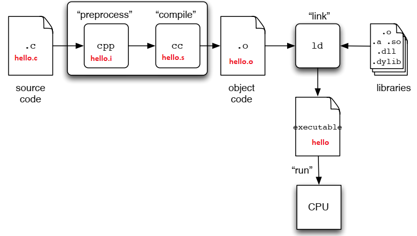
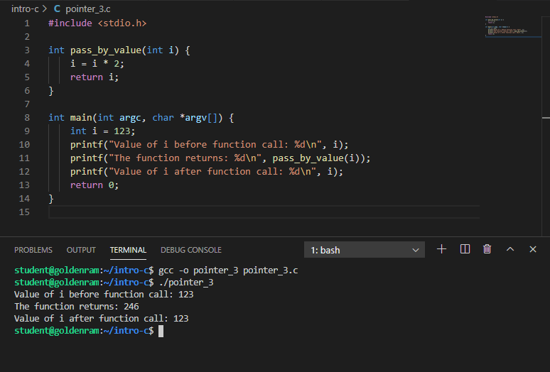

> ## What is C?     
>  
> - Developed by Dennis Ritchie at Bell Labs
> - First public released in 1972. 
> - **The** book: *The C programming languange" by Dennis M. Ritchie and Brian W. Kernighan. 
> Prentice Hall 1988. 
{: .slide}

> ## How to learn C (now that you already know Java)?     
>  
> - [C for Java programmers][c4java]
> - [C programming vs. Java programming][c_vs_java]
{: .slide}

> ## Scary stuff ahead ...     
>  
> - C is much less supportive for programmers than Java.
> - (Much) easier to make mistake, and (much) harder to fix. 
{: .slide}

> ## But it is exciting ...     
>  
> - C requires less memory resources than Java.
> - C, in many instances, runs faster than Java. 
> - Knowing C will make you a better programmer overall. 
{: .slide}

> ## Similarities (or mostly similar) between C and Java     
>  
> - Values, types, literals, expressions
> - Variables
> - Control flow (if, switch, while, for, do-while)
> - Call-return: parameters, arguments, return values
> - Arrays (mostly)
> - Primitive and reference types
> - Type casting. 
> - Library usage. 
{: .slide}

> ## Differences between C and Java     
>  
> - C has no classes or objects (but something similar)
> - C is not object-oriented. 
> - C arrays are simpler:
>   - No boundary checking. 
>   - No knowledge of array's own size. 
> - String operations are limited. 
> - No collections, exceptions, or generics. 
> - No automatic memory management. 
> - **Pointers!!!**
{: .slide}

> ## How Java programs run
>
> 
{: .slide}

> ## How C programs run
>
> 
{: .slide}

> ## Hands-on 1: Getting started
>
> - Connect VSCode to `taz.cs.wcupa.edu`. 
> - Navigate to your home directory.
> - Open a terminal
{: .slide}

> ## Hands-on 2: Setup directory
>
> Create a directory named `intro-c` inside your home directory, 
> then change into that directory.
>
> ~~~
> $ cd
> $ pwd
> $ mkdir intro-c
> $ ls
> $ cd intro-c
> ~~~
> {: .language-bash}
> 
> 
>
{: .slide}

> ## Hands-on 3: Create hello.c
>
> - In the **EXPLORER** window, right-click on `intro-c` and select `New File`.
> - Type `hello.c` as the file name and hits Enter. 
> - Enter the following source code in the editor windows:
> - Save the file when you are done: 
>   - `Ctrl-S` for Windows/Linux
>   - `Command-S` for Macs
> - **Memorize your key-combos!**.
>
> ~~~
> /*
>  * File: hello.c
>  */
> #include <stdio.h>
> int main(int argc, char *argv[]) {
>   printf("Hello world!\n");
>   return 0;
> }
> ~~~
> {: .language-c}
> 
> 
>
{: .slide}

> ## What's in the code?
>
> - Line 1-3: Comments, similar to Java.
> - Line 4: Standard C library for I/O, similar to Java's `import`.
> - Line 5-8: Function declaration for `main`:
>   - Line 5: 
>     - return type: `int`
>     - function name: `main`
>     - parameter list: 
>        - `argc`: number of command line arguments.
>        - `*argv[]`: pointers to array of command line argument strings. 
>    - Line 6: Invoke builtin function `printf` to print out  string `Hello world!`
>    with an end-of-line character `\n`. This is similar to `System.out.printf`.
>    - Line 7: Exit a successfully executed program with a return value of 0. 
>
> {: .language-c}
> 
> 
>
{: .slide}

> ## Hands-on 4: Simple compile and run
>
> - Similar to `javac`, we use `gcc` to compile C code. 
> - Before compile, make sure that you are still inside `intro-c` in the terminal. 
>
> ~~~
> $ pwd
> $ ls
> $ gcc -o hello hello.c
> $ ls
> $ ./hello
> ~~~
> {: .language-bash}
> 
> 
>
{: .slide}

> ## Hands-on 4: Compile and show everything
>
> - There are a number of steps from C codes to executable binaries.  
>
> ~~~
> $ ls
> $ gcc -save-temps -o hello2 hello.c
> $ ls -l
> $ ./hello2
> ~~~
> {: .language-bash}
> 
> 
>
{: .slide}

> ## What are those?
>
> - `hello.i`: generated by pre-processor
> - `hello.s`: generated by compiler.
> - `hello.o`: generated by assembler.
> - `hello`: executable, generated by linker.
> 
> 
>
{: .slide}

> ## Hands-on 5: View files
>
> - For `hello.i` and `hello.s`, they can be view on the editor. 
> - For `hello.o` and `hello`, we need to dump the binary contents first. 
>
> ~~~
> $ xxd -b hello.o > hello.o.txt
> $ xxd -b hello > hello.txt
> $ ls -l
> ~~~
> {: .language-bash}
> 
> - 
> 
>
{: .slide}

> ## Variables, Addresses, and Pointers
>
> - In Java, you can manipulate the value of a variable via the program but not directly 
> in memory (inside the JVM). 
> - In C, you can retrieve the address of the location in memory where the variable is 
> stored. 
> - The operator `&` (reference of) represents the memory address of a variable.
{: .slide}

> ## Hands-on 6: Pointer
>
> - In the **EXPLORER** window, right-click on `intro-c` and select `New File`.
> - Type `pointer_1.c` as the file name and hits Enter. 
> - Enter the following source code in the editor windows:
>
> ~~~
> #include <stdio.h>
> int main(int argc, char *argv[]) {
>   int i = 123;
>   printf("Variable i has addr (%p) and value %d\n", &i, i);
>   return 0;
> }
> ~~~
> {: .language-c}
> 
> - `%p` is an output conversion syntax (similar to Java specifiers) for displaying memory 
> address in hex format. See [Other Output Conversions][gcc_output_conversion] for more 
> details.
> - Compile and run `pointer_1.c`
> 
> 
>
{: .slide}

> ## Pointer Definition
>
> - Pointer is a variable that points to a memory location (contains a memory location).  
>   - We can them *pointer variables*. 
> - A pointer is denoted by a `*` character. 
> - The type of pointer must be the same as that of the value being stored in 
> the memory location (that the pointer points to).
> - If a pointer points to a memory location, how do we get these locations?
>   - An `&` character in front of a variable (includes pointer variables) denotes that
>   variable's address location. 
{: .slide}

> ## Hands-on 7: Pointer and Variable's Addresses
>
> - In the **EXPLORER** window, right-click on `intro-c` and select `New File`.
> - Type `pointer_2.c` as the file name and hits Enter. 
> - Enter the following source code in the editor windows:
>
> ~~~
> #include <stdio.h>
> int main(int argc, char *argv[]) {
>   int i = 123;
>   int *p_i = &i;
>   printf("Variable i has addr (%p) and value %d\n", &i, i);
>   printf("The pointer points to addr (%p) containing value %d\n", p_i, *p_i);
>   return 0;
> }
> ~~~
> {: .language-c}
> 
> - Since `p_i` is a pointer variable, `p_i` contains a memory address (hence `%p`).
> - Then, `*p_i` will point to **the value in the memory address contained in p_i**. 
>   - This is referred to as *de-referencing*. 
>   - This is also why the type of a pointer variable must match the type of data stored
>   in the memory address the pointer variable contains. 
> - Compile and run `pointer_2.c`
> 
> 
>
{: .slide}

> ## Pass by Value and Pass by Reference
>
> - Parameters are passed to functions. 
> - Parameters can be value variables or pointer variables. 
> - What is the difference?  
{: .slide}

> ## Hands-on 8: Pass by value
>
> - In the **EXPLORER** window, right-click on `intro-c` and select `New File`.
> - Type `pointer_3.c` as the file name and hits Enter. 
> - Enter the following source code in the editor windows:
>
> ~~~
> #include <stdio.h>
>
> int pass_by_value(int i) {
>    i = i * 2;
>    return i;
> }
>
> int main(int argc, char *argv[]) {
>   int i = 123;
>   printf("Value of i before function call: %d\n", i);
>   printf("The function returns: %d\n", pass_by_value(i)); 
>   printf("Value of i after function call: %d\n", i);
>   return 0;
> }
> ~~~
> {: .language-c}
>
> - Compile and run `pointer_3.c`
> 
> 
>
{: .slide}

> ## Hands-on 9: Pass by reference
>
> - In the **EXPLORER** window, right-click on `intro-c` and select `New File`.
> - Type `pointer_4.c` as the file name and hits Enter. 
> - Enter the following source code in the editor windows:
>
> ~~~
> #include <stdio.h>
>
> int pass_by_ref(int *a_pointer) {
>   *a_pointer = (*a_pointer) * 2;
>   return *a_pointer;
> }
>
> int main(int argc, char *argv[]) {
>   int i = 123;
>   printf("Value of i before function call: %d\n", i);
>   printf("The function returns: %d\n", pass_by_ref(&i)); 
>   printf("Value of i after function call: %d\n", i);
>   return 0;
> }
> ~~~
> {: .language-c}
>
> - Compile and run `pointer_4.c`
> 
> 
>
{: .slide}

> ## Question
>
> In Java, do you pass by value or pass by reference?
>
> > ## Answer     
> > - Primitives are passed by value. 
> > - Objects are passed by reference. 
> >
> {: .solution}
{: .challenge}

> ## Pointers and memory allocation
>
> - How does C request dynamic memory when you don't know at 
> compile-time exactly what you will need?
> - How does C allocate memory?
>   - Automatic: compile arranges for memory to be allocated 
>   and initialized for local variables when it is in scope.
>   - Static: memory for static variables are allocated once 
>   when program starts.
>   - Dynamic: memory is allocated on the fly as needed.
{: .slide}

> ## Dynamic memory allocation
>
> - Unlike Java, you have to do everything!
>   - Ask for memory.
>   - Return memory when you are done (garbage collection!).
> - C function: [`malloc`](https://linux.die.net/man/3/malloc)
>   - `void *malloc(size_t size);`
>   - The `malloc()` function allocates `size` bytes and returns 
>   a pointer to the allocated memory. The memory is **not initialized**. 
>   If size is 0, then `malloc()` returns either `NULL`, or a unique 
>   pointer value that can later be successfully passed to `free()`.
> - C function: [`free`](https://linux.die.net/man/3/free)
>   - void free(void *ptr);
>   - The `free()` function frees the memory space pointed to by ptr, 
>   which must have been returned by a previous call to `malloc()`, 
>   `calloc()` or `realloc()`. Otherwise, or if `free(ptr)` has already 
>   been called before, undefined behavior occurs. If `ptr` is `NULL`, 
>   no operation is performed.
{: .slide}

> ## Void pointer
>
> - When `malloc` allocates memory, it returns a sequence of bytes, with
> no predefined types. 
> - A pointer that points to this sequence of bytes (the address of the 
> starting byte), is called a **void pointer**.  
> - A void pointer will then be typecast to an appropriate type. 
{: .slide}

> ## Hands-on 10: Malloc and type cast
>
> - In the **EXPLORER** window, right-click on `intro-c` and select `New File`.
> - Type `malloc_1.c` as the file name and hits Enter. 
> - Enter the following source code in the editor windows:
>
> ~~~
> #include <stdlib.h>
> #include <stdio.h>
> 
> int main(int argc, char *argv[]) {
>   void *p = malloc(4);
>   int *ip = (int *)p;
>   *ip = 98765;
>   printf("%d\n", *ip);
>  return 0;
> }
> ~~~
> {: .language-c}
>
> - What points to where:
>   - `void *p = malloc(4);`: allocate 4 contiguous bytes. The address of the
>   first byte is returned and assign to pointer variable `p`. `p` has no 
>   type, so it is a `void pointer`. 
>   - `int *ip = (int *)p;`: The address value *pointed to* by `p` is assigned
>   to pointer variable `ip`. The bytes pointed to be `p` are now casted to 
>   type `int`. 
> - Compile and run `malloc_1.c`
> 
> 
>
{: .slide}

> ## Hands-on 11: Malloc and type cast with calculation
>
> - In the **EXPLORER** window, right-click on `intro-c` and select `New File`.
> - Type `malloc_2.c` as the file name and hits Enter. 
> - Enter the following source code in the editor windows:
>
> ~~~
> #include <stdlib.h>
> #include <stdio.h>
> 
> int main(int argc, char *argv[]) {
>   int *ip = (int *)malloc(sizeof(int));
>   *ip = 98765;
>   printf("%d\n", *ip);
>   return 0;
> }
> ~~~
> {: .language-c}
>
> - Only ask for exactly what you need!
> - Compile and run `malloc_2.c`
> 
> 
>
{: .slide}

> ## Hands-on 12: Safety
>
> - In the **EXPLORER** window, right-click on `intro-c` and select `New File`.
> - Type `malloc_3.c` as the file name and hits Enter. 
> - Enter the following source code in the editor windows:
>
> ~~~
> #include <stdlib.h>
> #include <stdio.h>
> 
> int main(int argc, char *argv[]) {
>   int *ip = (int *)malloc(sizeof(int));
>   *ip = 98765;
>   printf("%d\n", *ip);
>   free(ip);
>   ip = NULL;
>   return 0;
> }
> ~~~
> {: .language-c}
>
> - Only ask for exactly what you need!
> - Compile and run `malloc_3.c`
> 
> 
>
{: .slide}

> ## Dynamic memory allocation
>
> - Critical to support complex data structures that grow as the 
>  program executes. 
> - In Java, custom classes such as ArrayList and Vector provide 
> such support.
> - In C, you have to do it manually: How?
> - Let’s start with a simpler problem:
>   - How can we dynamically allocate memory to an array 
>   whose size is not known until during run time?
{: .slide}

> ## Hands-on 13: What does an array in C look like?
>
> - In the **EXPLORER** window, right-click on `intro-c` and select `New File`.
> - Type `array_1.c` as the file name and hits Enter. 
> - Enter the following source code in the editor windows:
>
> ~~~
> #include <stdio.h>
> int main(int argc, char *argv[]) {
>   int numbers[5];
>   int i;
>   for (i = 0; i < 5; i++){
>     numbers[i] = i * 2;
>     printf("Index %d has value %d at address (%p)\n", i, numbers[i], (numbers + i));
>   }
>   return 0;
> }
> ~~~
> {: .language-c}
>
> - What is the distance between addresses? Why?
> - Compile and run `array_1.c`
> 
> 
>
{: .slide}

> ## Exercise
>
> - Create a copy of `array_1.c` called `array_2.c`. 
> - Change the type of `numbers` to `double`. 
> - What is the address step now?
>
> > ## Answer     
> >  
> >
> {: .solution}
{: .challenge}

> ## An array variable
>
> - ... is in fact pointing to an address containing a value. 
> - ... without the bracket notation and an index points to the 
> corresponding address of the value at the index. 
> - ... is quite similar to a pointer!
{: .slide}

> ## Hands-on 14: Array as pointer (or vice versa ...)
>
> - In the **EXPLORER** window, right-click on `intro-c` and select `New File`.
> - Type `array_3.c` as the file name and hits Enter. 
> - Enter the following source code in the editor windows:
>
> ~~~
> #include <stdio.h>
> #include <stdlib.h>
> int main(int argc, char *argv[]) {
>   int i, size;
>   int *p; 
>   size = 5;
>   p = malloc(sizeof(int) * size);
>   for (i = 0; i < size; i++){
>     printf("Before init, index %d has value %d at addr (%p)\n", i, p[i], p + i);
>     p[i] = i * 2;
>     printf("After init, index %d has value %d at addr (%p)\n", i, p[i], p + i);
>   }
>   return 0;
> }
> ~~~
> {: .language-c}
>
> - Compile and run `array_3.c`
> 
> 
>
{: .slide}

> ## Hands-on 15: Dynamic array creation with command line arguments. 
>
> - In the **EXPLORER** window, right-click on `intro-c` and select `New File`.
> - Type `array_4.c` as the file name and hits Enter. 
> - Enter the following source code in the editor windows:
>
> ~~~
> #include <stdio.h>
> #include <stdlib.h>
> int main(int argc, char *argv[]) {
>   int i, size;
>   int *p; 
>   size = atoi(argv[1]);
>   printf(“Before malloc, p is pointing to address (%p)\n”, p);
>   p = malloc(sizeof(int) * size);
>   for (i = 0; i < size; i++){
>     p[i] = i * 2;
>     printf("After malloc and assignment, index %d has value %d at addr (%p)\n", i, p[i], p + i);
>   }
>   return 0;
> }
> ~~~
> {: .language-c}
>
> - In C, the command line arguments **include** the program's name. The
> actual arguments start at index position 1 (not 0 like Java).
> - Compile and run `array_4.c`
> 
> 
>
{: .slide}

> ## Hands-on 16: String 
>
> - In the **EXPLORER** window, right-click on `intro-c` and select `New File`.
> - Type `string_1.c` as the file name and hits Enter. 
> - Enter the following source code in the editor windows:
>
> ~~~
> #include<stdio.h> 
> 
> int main(int argc, char *argv[]) {    
>   int i;
>   char str[] = "Hello, world!"; 
>   printf("%s\n",str);     
>   for (i = 0; i < 12; i++) {
>     printf("%c ", str[i]);
>   } 
>   printf("\n");
>   return 0; 
> } 
> ~~~
> {: .language-c}
>
> - Compile and run `string_1.c`
> 
> 
>
{: .slide}

> ## Hands-on 17: Array of strings
>
> - In the **EXPLORER** window, right-click on `intro-c` and select `New File`.
> - Type `string_2.c` as the file name and hits Enter. 
> - Enter the following source code in the editor windows:
>
> ~~~
> #include <stdio.h>
> #include <stdlib.h>
> #include <string.h>
>
> int main(int argc, char *argv[]){ 
>   int i, word_count;
>   int str_len[2] = {6, 4};
>   char **s_array;
>   word_count = 2;
>   s_array = (char**)calloc(word_count, sizeof(char *));
>   for (i = 0; i < word_count; i++){
>     s_array[i] = (char *)calloc(str_len[i], sizeof(char));
>   }
>   strcpy(s_array[0], "Golden");
>   strcpy(s_array[1], "Rams");
>   printf("%s %s\n", s_array[0], s_array[1]);
>   return 0;
> }
> ~~~
> {: .language-c}
>
> - Compile and run `string_2.c`
> 
> 
>
{: .slide}

> ## Object in C
>
> - C has no classes or objects. 
> - Instead, it has `struct` type (think ancestor of objects) .
{: .slide}

> ## Hands-on 18: Struct in C
>
> - In the **EXPLORER** window, right-click on `intro-c` and select `New File`.
> - Type `struct_1.c` as the file name and hits Enter. 
> - Enter the following source code in the editor windows:
>
> ~~~
> #include <stdio.h>
> 
> struct point {
>   int x;
>   int y;
> };
> 
> int main(int argc, char *argv[]){ 
>   struct point origin;
>   origin.x = 0;
>   origin.y = 0;
>
>   printf("The coordinates of the origin are: %d %d\n", origin.x, origin.y);
>   printf("The address of coordinates of the origin are: %p %p\n", &origin.x, &origin.y);
>   return 0;
> }
> ~~~
> {: .language-c}
>
> - Compile and run `struct_1.c`
> 
> 
>
{: .slide}

> ## Hands-on 19: Struct of structs in C
>
> - In the **EXPLORER** window, right-click on `intro-c` and select `New File`.
> - Type `struct_2.c` as the file name and hits Enter. 
> - Enter the following source code in the editor windows:
>
> ~~~
> #include <stdio.h>
> 
> struct point {
>   int x;
>   int y;
> };
> 
> struct line {
>   struct point start;
>   struct point end;
> };
>
> int main(int argc, char *argv[]){ 
>   struct point origin;
>   origin.x = 0;
>   origin.y = 0;
>
>   printf("The coordinates of the lines are: %d %d %d %d\n", 
>           l.start.x, l.start.y, l.end.x, l.end.y);
>   printf("The address of coordinates of the origin are: %p %p %p %p\n", 
>           &l.start.x, &l.start.y, &l.end.x, &l.end.y);
>   return 0;
> }
> ~~~
> {: .language-c}
>
> - Compile and run `struct_1.c`
> 
> 
>
{: .slide}

> ## Function in C
>
> - Almost the same as methods in Java, except for one small difference. 
> - They need to either be declared, or must be defined prior to being
> called (relative to written code position). 
{: .slide}

> ## Hands-on 20: Functions in C - definition and declaration
>
> - Create three C files, `funcion_1.c`, `function_2.c`, and `function_3.c`,
> with the source codes below:
>
> ~~~
> /* function_1.c */
> #include <stdio.h>
> 
> int times2(int x) {
>   return x * 2;
> }
>
> int times4(int x) {
>   return times2(x) * 2;
> }
> 
> int main(int argc, char *argv[]) {
>   int x = 100;
>   printf("Result: %d\n", times4(x));
>   return 0;
> }
> ~~~
> {: .language-c}
>
> ~~~
> /* function_2.c */
> #include <stdio.h>
> 
> int times4(int x) {
>   return times2(x) * 2;
> }
>
> int times2(int x) {
>   return x * 2;
> }
> 
> int main(int argc, char *argv[]) {
>   int x = 100;
>   printf("Result: %d\n", times4(x));
>   return 0;
> }
> ~~~
> {: .language-c}
>
> ~~~
> /* function_3.c */
> #include <stdio.h>
> int times2(int x);
> int times4(int x);
>
> int times4(int x) {
>   return times2(x) * 2;
> }
>
> int times2(int x) {
>   return x * 2;
> }
> 
> int main(int argc, char *argv[]) {
>   int x = 100;
>   printf("Result: %d\n", times4(x));
>   return 0;
> }
> ~~~
> {: .language-c}
> - Compile and run these files. 
> 
> 
>
{: .slide}


