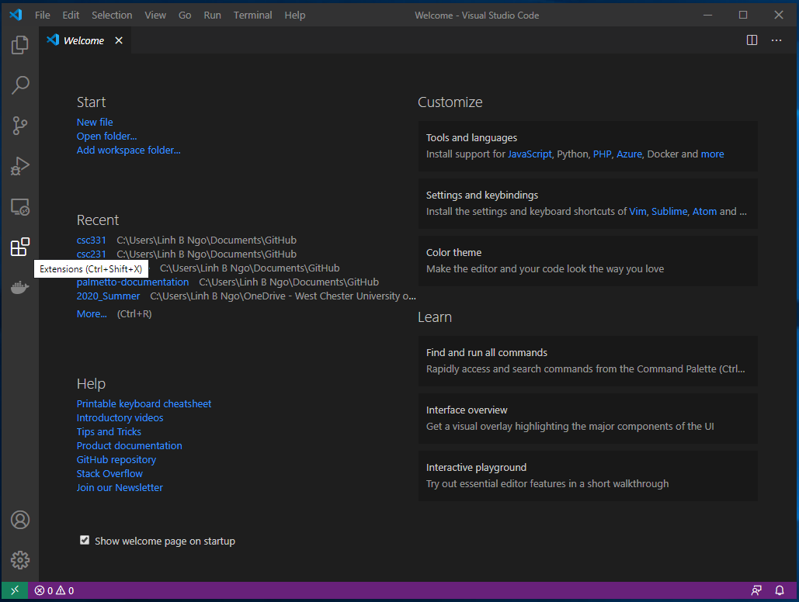
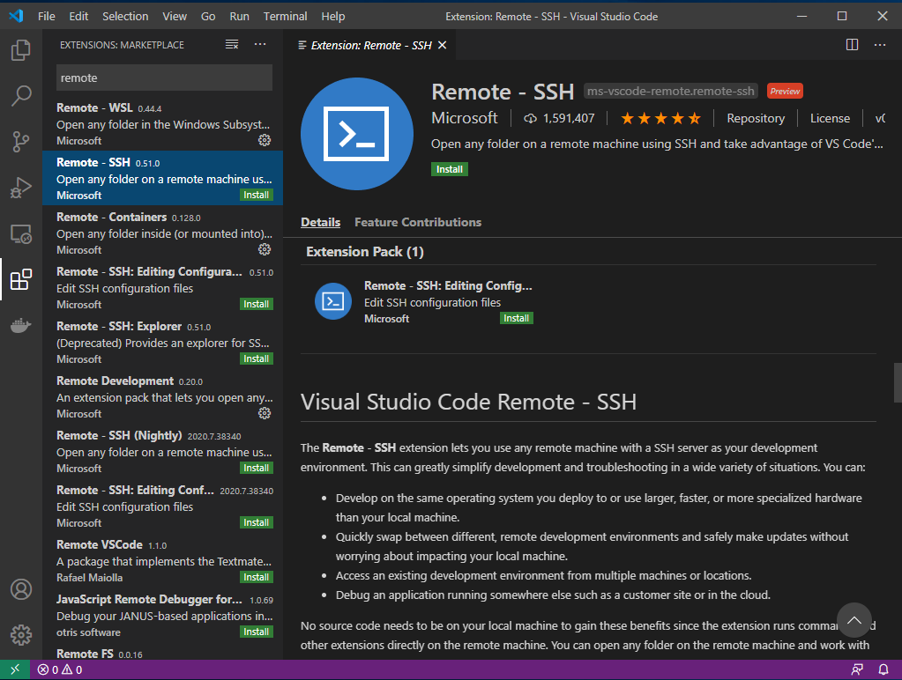
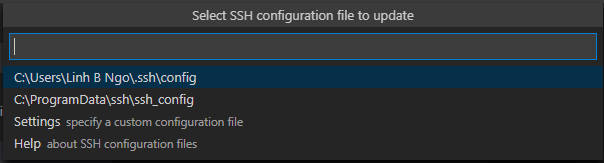
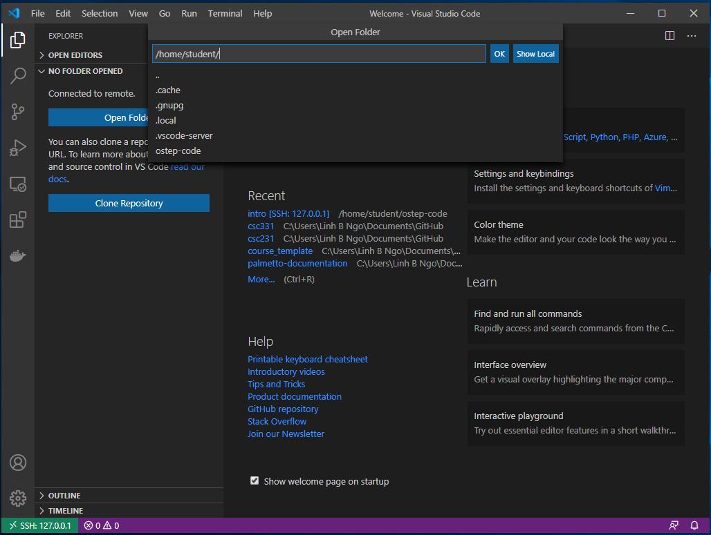

> ## To do
> To prepare for this course, the following tasks need to be carried out:
> - Installation of Visual Studio Code (VSCode)
> - Link VSCode to `taz.cs.wcupa.edu`.
> - Setup GitHub account
{: .checklist}

## Installation of VSCode

- Go to [VSCode's download page][vscode] and download the correct package for your computer (Windows, Mac OS, or Linux). 
- For Windows, you can download `User Installer 64-bit` version if you only want to install VSCode into your user account.  


## Link VSCode to taz.cs.wcupa.edu

- Launch VSCode. 
- On the left bar, select the `Extension` button (the button with blocks). 



- Type **remote** in the search box.
- Select the **Remote - SSH**, then click `Install`. 



- Once the installation finish, click on the bottom left green button. If you mouse over the button, it shows **Open a remote windows**. 
- Select **Remote-SSH: Connect to Host...**.


- Select **Add New SSH Host...**


- Enter the following into the **Enter SSH Connection Command** box:
- Remember to replace **USERNAME** with your `taz` account name. 

```
ssh USERNAME@taz.cs.wcupa.edu
```


- Select the top option for the **SSH configuration file to update**. 



- Next, repeat the step where you clicked the **Open a remote windows** option. 
- This time, the `taz.cs.wcupa.edu` host will show up. 
- Click on this host. 


- Select `Linux` as the platform for `taz.cs.wcupa.edu`. 


- Enter the password for your `taz` account. 


- You should see the bottom left green bar now show the `taz.cs.wcupa.edu` connection. 


- Click the top left Explorer button. 
- Click `OK`, as we want to open and view the files in `/home/YOUR_USER_NAME`. 
- You will be asked to enter the password again. 



- You will see the files and directories in `/home/YOUR_USER_NAME` in the left windows. 
- Click `Terminal` and select `New Terminal`. 
- A `bash` shell into the VM will be opened. 


## Setup GitHub account
- If you don't already have a GitHub account, go to [GitHub web page][github] to sign up for an account. 
- It should be noted that you can link multiple email addresses to a GitHub account. Even if you
 already have a GitHub account, you might want to link the account to your WCUPA email. 


## Setup an XSEDE account
- Visit [XSEDE Portal page][xsede] to create an account on XSEDE. 
- Watch out in case the confirmation email will go into WCUPA' spam folder. You can visit [https://wcupa.login-us.mimecast.com/], click on the `...` side tab, then `Personal On Hold` to see if the 
confirmation email is there. 
- Once you finished registering, go to the following [Google Form](http://bit.ly/2ZtIas1) to fill out information about your XSEDE account. It is **important** that you give me your XSEDE account, which is the `USER NAME` that you use to login to XSEDE portal. 



